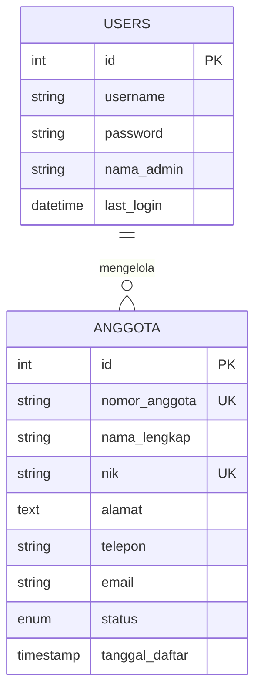

# Entity Relationship Diagram (ERD) - Koperasi Digital

Berikut adalah diagram ERD yang menjelaskan struktur tabel dan atribut dalam database `db_koperasi`:

### Penjelasan Entitas:

1.  **USERS (Admin):**
    *   `id`: Primary Key (ID unik admin).
    *   `username`: Nama unik untuk login.
    *   `password`: Kata sandi yang di-hash (keamanan).
    *   `nama_admin`: Nama lengkap administrator.
    *   `last_login`: Mencatat waktu terakhir kali admin masuk ke sistem.

2.  **ANGGOTA:**
    *   `id`: Primary Key (ID unik anggota).
    *   `nomor_anggota`: Nomor identitas koperasi (Unique Key).
    *   `nama_lengkap`: Nama lengkap anggota.
    *   `nik`: Nomor Induk Kependudukan (Unique Key).
    *   `alamat`: Alamat tempat tinggal anggota.
    *   `telepon`: Nomor kontak anggota.
    *   `email`: Alamat surel anggota.
    *   `status`: Status keanggotaan (Aktif/Non-Aktif).
    *   `tanggal_daftar`: Tanggal otomatis saat data anggota dibuat.

### Hubungan (Relationship):
Dalam sistem ini, hubungan antara **USERS** dan **ANGGOTA** bersifat logis sebagai **"Mengelola"**. 
*   Seorang Admin (**User**) dapat mengelola banyak (**Many**) data **Anggota**.
*   Sistem saat ini bersifat mandiri (independent), di mana relasi lebih ditekankan pada hak akses Admin untuk melakukan operasi CRUD terhadap data Anggota.
