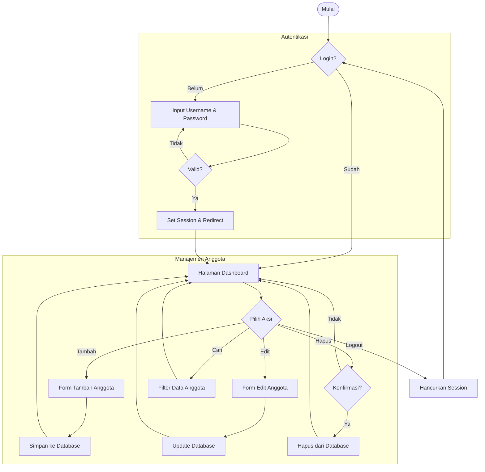

# Alur Sistem Koperasi Digital

Berikut adalah flowchart yang menjelaskan alur kerja sistem manajemen anggota koperasi:

### Penjelasan Alur:

1.  **Autentikasi:** Sistem dimulai dengan mengecek apakah user sudah login. Jika belum, user diarahkan ke halaman login untuk memasukkan username dan password.
2.  **Dashboard:** Setelah login berhasil, user masuk ke Dashboard yang menampilkan statistik dan daftar seluruh anggota.
3.  **Manajemen Anggota:** Di Dashboard, admin dapat melakukan beberapa aksi:
    *   **Tambah:** Mengisi formulir anggota baru. Nomor anggota di-generate otomatis oleh sistem.
    *   **Edit:** Mengubah data anggota yang sudah ada (NIK, Nama, Status, dll).
    *   **Hapus:** Menghapus data anggota dengan konfirmasi terlebih dahulu.
    *   **Cari:** Mencari anggota berdasarkan Nama, NIK, atau Nomor Anggota.
4.  **Logout:** Admin dapat keluar dari sistem, yang akan menghapus session dan mengembalikan user ke halaman login.
